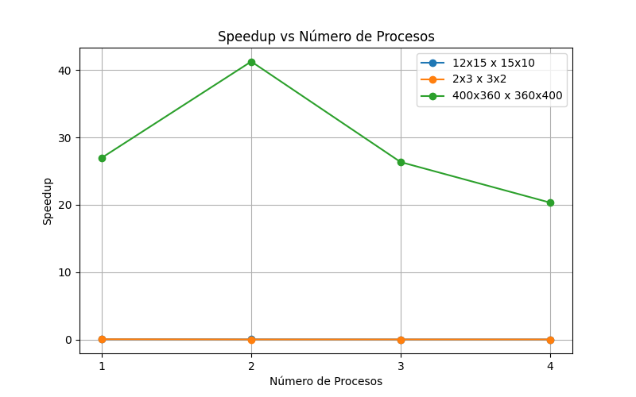

# Multiplicación de Matrices con Procesos Paralelos en C y go

Universidad de Antioquia  
Curso: Sistemas Operativos  
Práctica #2 - Multiplicación de matrices con procesos  

**Integrantes:**

- [X] [Maritza Tabarez Cárdenas](https://github.com/MaritzaTC)
- [X] [Juan David Vasquez Ospina](https://github.com/JuanVasquezO)


##  Objetivos

- Comprender la creación de procesos usando `fork()`.
- Implementar cómputo paralelo dividiendo la carga de trabajo entre múltiples procesos (en C) o gorutinas (en Go) usando APIs del sistema operativo.
- Aprender y aplicar mecanismos de comunicación entre procesos (IPC), como pipes o memoria compartida (en C), y canales o estructuras para compartir memoria (en Go).
- Analizar y comparar el rendimiento entre las implementaciones secuenciales y paralelas de la multiplicación de matrices.

---

##  Descripción del problema

Desarrollar un programa en C que multiplique dos matrices grandes:

- Matriz A (N×M)  
- Matriz B (M×P)  
- Resultado: Matriz C (N×P)

## Para C
Se debe implementar:

-  Versión secuencial (`sequential.c`)  
-  Versión paralela con procesos (`parallel.c`) usando memoria compartida
-  Version secuencial y paralela (`sequientialAndParallel.c`)


## ⚙️ Compilación

Usar `gcc` para compilar:

```bash
gcc sequential.c -o sequential
gcc parallel.c -o parallel
gcc sequientialAndParallel.c -o parallel_matrix_multiply
```


▶️ Ejecución

```bash
./sequential
./parallel
```

Al ejecutar, el programa pedirá las dimensiones de las matrices (N, M, P) y leerá los datos desde los archivos A.txt y B.txt. El resultado se escribirá en C.txt.

## Entrada y Salida
Entrada: Archivos A.txt, A_small.txt, A_big y B.txt,B_small.txt, B_big con los valores de las matrices.

Salida: Archivo C.txt con la matriz resultado.

# Informe Técnico
1. Elección del mecanismo IPC
Para la implementación paralela, se utilizó memoria compartida (Shared Memory) mediante las funciones shmget() y shmat() de la API de System V. 

    Esta elección se basa en:

    - Velocidad: La memoria compartida permite el acceso directo a la región común de memoria, lo que evita copias innecesarias de datos.

    - Simplicidad en agregación: Los procesos hijos escriben directamente en la matriz C, eliminando la necesidad de combinar resultados tras el cálculo.

    - Escalabilidad: Es más eficiente que otros mecanismos como pipes para grandes volúmenes de datos.


### Análisis de Rendimiento
Algunos pantallazos de los resultados 


## Tabla de tiempos y speedup

| N   | M   | P   | Nº Procesos | Tiempo Secuencial (s) | Tiempo Paralelo (s) | Speedup |
|-----|-----|-----|-------------|----------------------|---------------------|---------|
| 12  | 15  | 10  | 1           | 0.0001               | 0.0019              | 0.05    |
| 12  | 15  | 10  | 2           | 0.0001               | 0.0027              | 0.03    |
| 12  | 15  | 10  | 3           | 0.0001               | 0.0037              | 0.02    |
| 12  | 15  | 10  | 4           | 0.0001               | 0.0045              | 0.02    |
| 2   | 3   | 2   | 1           | 0.0001               | 0.0015              | 0.05    |
| 2   | 3   | 2   | 2           | 0.0001               | 0.0028              | 0.02    |
| 2   | 3   | 2   | 3           | 0.0001               | 0.0036              | 0.02    |
| 2   | 3   | 2   | 4           | 0.0001               | 0.0044              | 0.02    |
| 400 | 360 | 400 | 1           | 1.0425               | 0.0386              | 26.99   |
| 400 | 360 | 400 | 2           | 0.8743               | 0.0212              | 41.26   |
| 400 | 360 | 400 | 3           | 0.9131               | 0.0347              | 26.34   |
| 400 | 360 | 400 | 4           | 0.9994               | 0.0491              | 20.33   |


## Gráfico Speedup vs Número de Procesos



### Interpretación del gráfico Speedup vs Número de Procesos
- Para matrices pequeñas (2x3 x 3x2 y 12x15 x 15x10):

    El speedup es muy bajo, incluso menor que 1 en algunos casos, lo que indica que la versión paralela no es eficiente para estos tamaños pequeños.

    De hecho, el tiempo paralelo es incluso mayor que el secuencial, reflejado en speedups menores a 1 (0.05, 0.02, etc.).

    Esto se debe a que la sobrecarga de crear y gestionar procesos, sincronizar y dividir el trabajo supera cualquier beneficio que se obtenga al paralelizar la multiplicación de matrices tan pequeñas.

    Además, aumentar el número de procesos no mejora significativamente el rendimiento; en algunos casos, lo empeora.

- Para matrices grandes (400x360 x 360x400):

    El speedup es mucho mayor, llegando a valores superiores a 20 o 40 en algunos casos, lo que indica que la paralelización sí da un gran beneficio.

    Esto es esperado porque con matrices grandes la carga de trabajo es mayor, por lo que dividir la tarea entre procesos reduce mucho el tiempo total.

    Sin embargo, el speedup no crece de forma perfectamente lineal con el número de procesos: hay un máximo (41.26 con 2 procesos) y luego baja.

    Esta caída puede ser causada por la sobrecarga de comunicación y sincronización entre procesos cuando se usan más de dos procesos, o limitaciones de hardware (como número de núcleos físicos disponibles).

    Aún así, la paralelización es claramente beneficiosa para cargas de trabajo grandes.


 ## References
 • OSTEP: Processes API Chapter.
 • Linux man pages: fork(), shmget(), pipe()